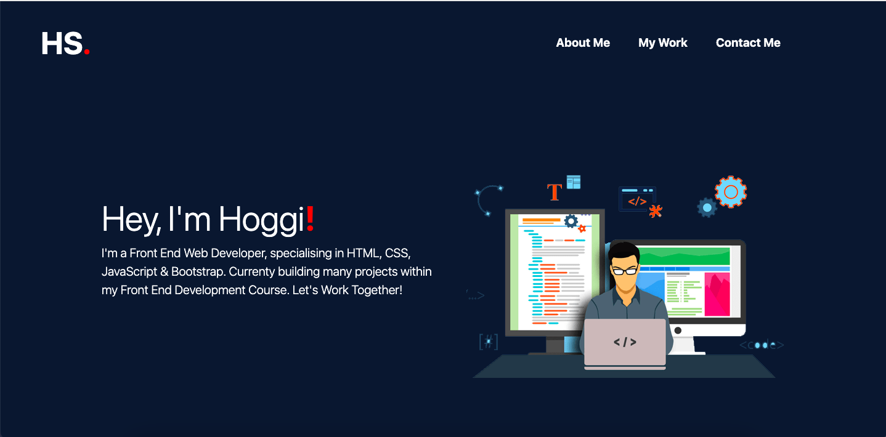
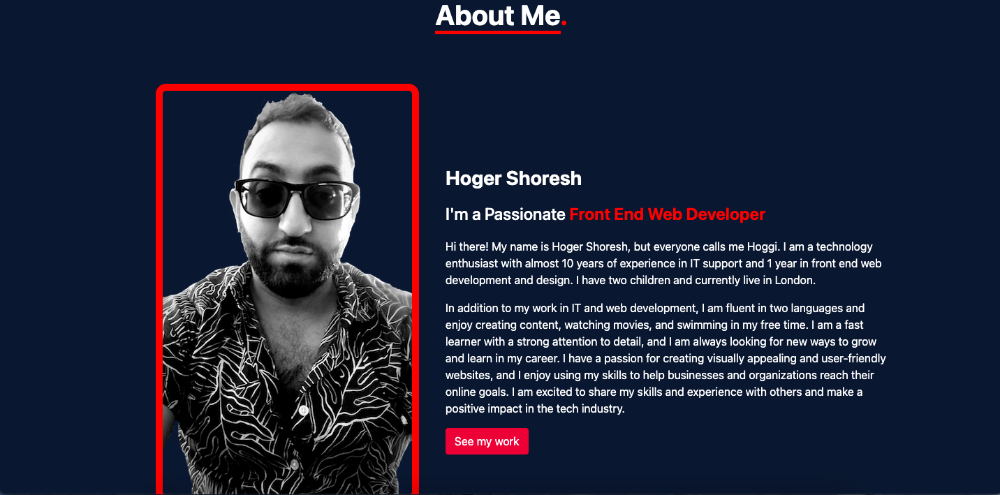
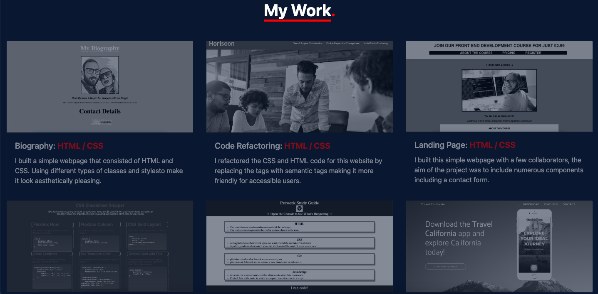
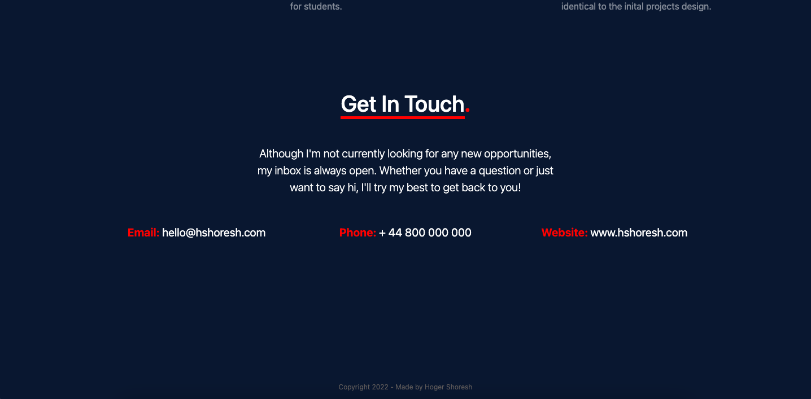

# Bootstrap-Portfolio

# Desciption

## This project invovled me building a portfolio for the previous front end development work I have done. This project in particular was built using bootstrap 4.3 components. It consists of 4 major parts, the inital jumbotron section, the about me section, my work section and the contact section. 

# Usage

## You can access the page via this link: https://hoggi90.github.io/New-Hoger-Shoresh-Portfolio/ 

## You can use the navigation bar to navigate to different parts of the page. The page includes a few links that take you certain sections or other pages.

# Screenshots

